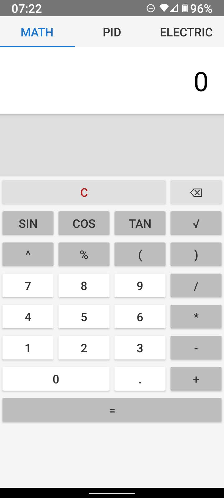
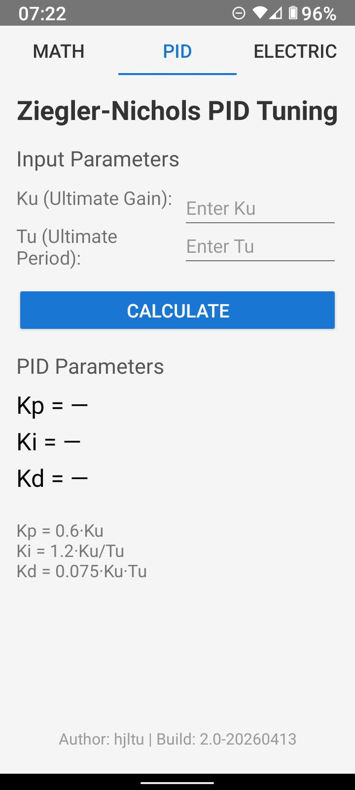
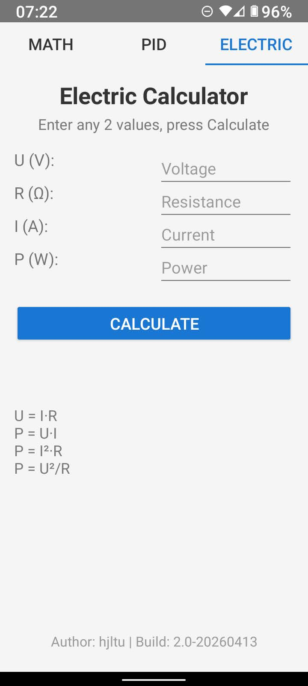

# AndroidCalculator

A scientific calculator app for Android with three functional tabs: Math, PID, and Electric.

**Build:** 2.0-20260413 | **Author:** hjltu | **minSdk:** 24 | **targetSdk:** 34

---

## Features

### Math Tab (default)



Full-featured scientific calculator with expression parsing, history, and percentage support.

**Operations:**
- Basic: `+`, `-`, `*`, `/`
- Power: `^`
- Percentage: `%` (e.g., `8%2 = 0.16` — left * right / 100)
- Parentheses: `(`, `)`
- Scientific: `sin`, `cos`, `tan`, `sqrt` (arguments in degrees)
- Decimal: `.`

**Controls:**
- `C` — clear expression
- `⌫` — backspace
- `=` — evaluate

**History:** Previous calculations appear in the history list above the buttons.

**Display:** Long expressions expand over the history area without shifting buttons.

### PID Tab



Ziegler-Nichols PID tuning calculator.

**Input:**
- Ku — Ultimate gain
- Tu — Ultimate period

**Output (PID formulas):**
- Kp = 0.6 * Ku
- Ki = 1.2 * Ku / Tu
- Kd = 0.075 * Ku * Tu

### Electric Tab



Ohm's law and power calculator.

**Input:** Any 2 of 4 values:
- U — Voltage (V)
- R — Resistance (Ω)
- I — Current (A)
- P — Power (W)

**Formulas used:**
- U = I * R
- P = U * I
- P = I² * R
- P = U² / R

Press **Calculate** to compute the remaining 2 values.

---

## Project Structure

```
app/src/main/
├── java/com/example/calculator/
│   ├── MainActivity.java           — Tab host (Math / PID / Electric)
│   ├── MathCalcFragment.java       — Math calculator logic
│   ├── PidCalcFragment.java        — Ziegler-Nichols PID calculator
│   ├── ElectricCalcFragment.java   — Ohm's law electric calculator
│   └── ExpressionEvaluator.java    — Recursive-descent math parser
├── res/
│   ├── layout/
│   │   ├── activity_main.xml           — TabLayout + FrameLayout
│   │   ├── fragment_math_calc.xml      — Calculator grid + display
│   │   ├── fragment_pid_calc.xml       — PID input/output form
│   │   └── fragment_electric_calc.xml  — Electric input/output form
│   └── values/
│       └── strings.xml
└── AndroidManifest.xml
```

## Dependencies

- AndroidX AppCompat 1.6.1
- Material Components 1.11.0
- ConstraintLayout 2.1.4
- GridLayout 1.0.0

## Build

```
./gradlew assembleDebug
```

APK output: `app/build/outputs/apk/debug/app-debug.apk`
